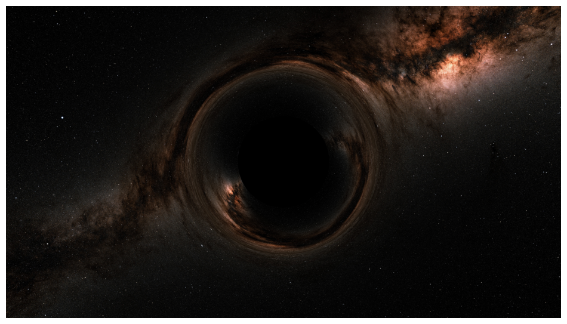

# Black hole simulator

Simulates a black hole using the Schwarschild metric in Eddington-Finkelstein coordinates. For efficiency, uses JAX with JIT compilation for fast linear algebra, and leverages spherical solution symmetry. Renders images using raytracing and a customizable skybox background. Support for outputting static images, animated GIFs, and MP4s.

